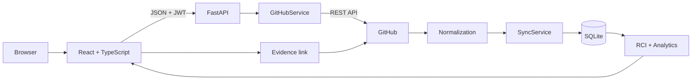
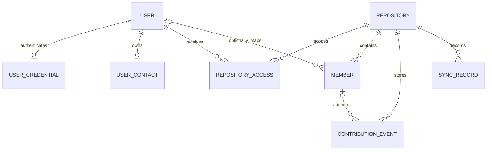

# Architecture

## System boundary

CollabTrace V1 is a local full-stack application. It uses no Redis, Docker, PostgreSQL, webhook, OAuth, LLM or cloud deployment component.



The frontend only calls FastAPI. GitHub credentials and GitHub API traffic remain on the backend.

## Main backend layers

- `app/routes`: HTTP endpoints and dependency-based authorization.
- `app/github`: GitHub HTTP client, collection service and event normalization.
- `app/services`: authentication, sync, analytics, RCI, mapping and access rules.
- `app/database`: SQLAlchemy engine and persistent models.
- `app/models`: validated request/response and contribution schemas.

## Authentication flow

```text
Register: React → FastAPI validation → Argon2id hash → SQLite
Login: React → nickname/email lookup → Argon2id verify → signed JWT
```

Public registration always creates a global `MEMBER` (shown as Standard User). Email is unique and normalized, but remains unverified. SMTP and verification codes are not dependencies of startup, registration or login.

## Data flow

1. A user submits `owner/repo` or an allowed `github.com` URL.
2. FastAPI validates identity and repository permission.
3. `GitHubService` fetches a bounded number of repository pages and PR reviews.
4. Raw GitHub objects are normalized into Commit, Pull Request, Issue and Review events.
5. `SyncService` upserts by `(repository_id, event_id)`, updates mapping references and records the sync result.
6. Analytics read SQLite only; opening Dashboard or Quick View does not call GitHub.
7. `ContributionIndexService` applies RCI_V1 filters and team normalization at request time.
8. Evidence returns stored records and their original `github_url` when available.

Analyze and Sync emit concise `collabtrace.flow` INFO logs for repository resolution, GitHub fetch, normalization, persistence and completion. These logs reuse counts already produced by the request; they do not trigger another GitHub call and never include request authorization, tokens, passwords or verification codes.

## Persistent model



- `User`: account identity and System Role.
- `UserCredential`: Argon2id hash and active flag.
- `UserContact`: optional unique email and verification state.
- `VerificationCode`: legacy compatibility table retained to avoid a destructive migration; it is not used by the current authentication flow.
- `Repository`: GitHub repository metadata and last sync time.
- `RepositoryAccess`: per-user, per-repository role.
- `Member`: GitHub contributor identity and optional CollabTrace user mapping.
- `ContributionEventRecord`: normalized evidence with stable event ID and optional GitHub URL.
- `SyncRecord`: success/failure, timing and inserted/updated/unchanged counts.

## Consistency and recovery

Contribution events have a unique `(repository_id, event_id)` constraint. Repeated syncs update existing rows rather than multiplying evidence. A sync creates a durable `RUNNING` record, then ends as `SUCCESS` or `FAILED`, including cancellation. SQLite is the source of truth; backup files under `data/backups/` are ignored by Git.

## Scope limits

`QUICK_ANALYZE_MAX_PAGES` and `QUICK_ANALYZE_MAX_PRS_FOR_REVIEWS` bound live analysis. General sync also follows backend GitHub client limits. Metric coverage is reported because stored metadata can be partial. This architecture never claims complete repository history.
